# FACE RECOGNITION

## 1. Requirements
- [Docker](https://docs.docker.com/engine/install/)
- [Docker Compose](https://docs.docker.com/compose/install/)

## 2. Set up
Clone code and put code at your directory. I call this is YOUR_DIRECTORY. Create new data directory. Structure as below:
```bash
YOUR_DIRECTORY
├── config
├── data
├── model
├── operations
├── pics
├── weights
├── .dockerignore
├── .gitignore
├── docker-compose.yml
├── Dockerfile
├── encode.py
├── infer.py
├── logs.py
├── main.py
├── requirements.txt
├── test_model.bash
├── test_model.py
├── milvus_helpers.py # Connect to Milvus server and insert/drop/query vectors in Milvus.
├── mysql_helpers.py # Connect to MySQL server, and add/delete/query IDs and object information.
```

- Use pretrain model:   
Download the [weight](https://drive.google.com/file/d/1ZUA02NPt_nElbFlsTpJofCTxgE1gdYhP/view?usp=sharing) and push it under weights folder  
Replace checkpoint path at [here](https://github.com/Lill98/face_recognition/blob/de10d6e72fd769b7972750405c22dd0047ea38d8/main.py#L41) to "weights/adaface_ir101_webface12m.ckpt"
- Use Retrain model:  
Download the [weight](https://drive.google.com/file/d/1BDBwt-ZNydUavfnFfNO9HQEXR6SC1kLP/view?usp=sharing) and push it under weights folder  
Replace checkpoint path at [here](https://github.com/Lill98/face_recognition/blob/de10d6e72fd769b7972750405c22dd0047ea38d8/main.py#L41) to "weights/Retrain_101.ckpt"


## 3. Deploy
### 3.1. Deploy service

After install docker and docker-compose at 1, cd to YOUR_DIRECTORY and run 
```
docker-compose -p face_recognition up --build -d
```
Open `127.0.0.1:5001/docs` in your browser to view all the APIs.

To close the container run:
```
docker-compose -p face_recognition down

```
To restart the docker run:
```
docker-compose -p face_recognition up -d
```
The API as below:

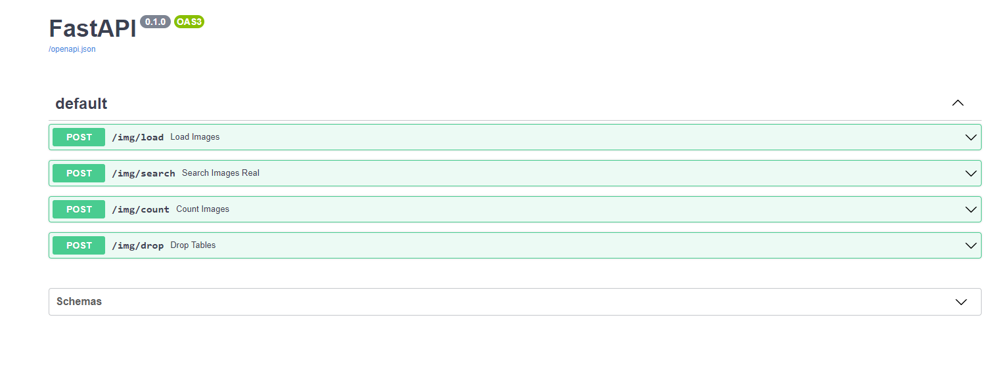

### 3.2. Deploy backup restore
Create environment with python 3.8  
Install package:  
```
pip install -r requirements_backup.txt
```
run the api:
```
python main_backup_restore.py
```

## 4. How to use service api

### 4.1 Load image to database 
- Put your image folder under **data directory**. For example name of folder is **company1** (you can put all staff_name_1 under data directory). Structure as bellow:

```bash
YOUR_DIRECTORY
├── config
├── data
    ├── company1
        ├── staff_name_1
                    ├── image1.jpg
                    ├── image2.jpg
                    ...
        ├── staff_name_2
        ...
...
```
Navigate to load api and work as below:
<!-- 
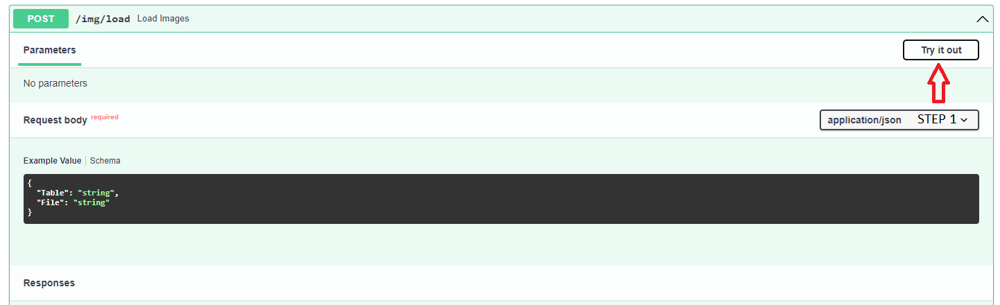
Path to image folder in this example is **/data/company1** -->
Table: Name of table  
Check_exists: True if you wan to check pat, otherwise False
File: Path to folder 
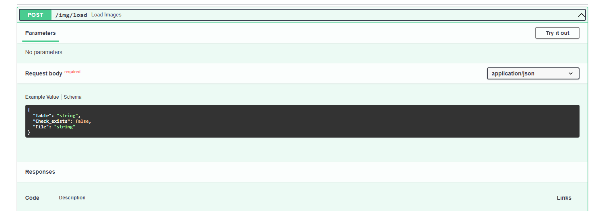

Wait until receive message as below:


### 4.2 Searching
Navigate to search api and work as below:  
The name of table is the same as load image 
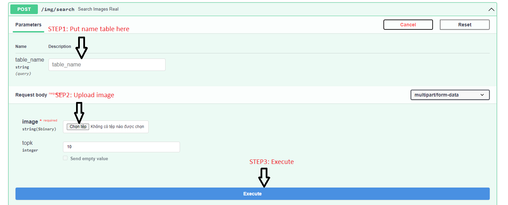

Name: name of folder  
distance: minimum distance  
path: path to the same image
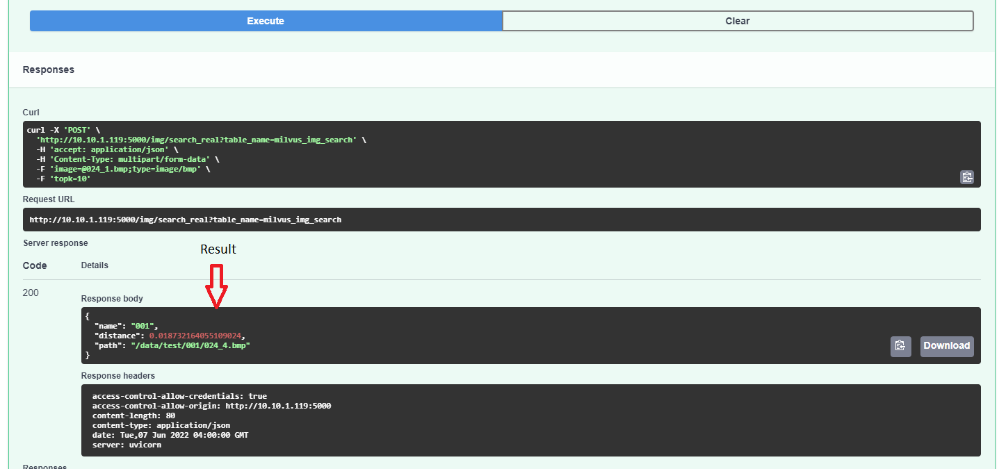

### 4.3 Upload image
Navigate to upload api and work as below      
url: path to folder where you want to save upload image. you need to put a list here  
images: list of image respective to url  
Example: I want to upload image to staff_name_1 folder, path to folder in this example is **/data/company1/staff_name_1**  
The name of image doesn't included in folder
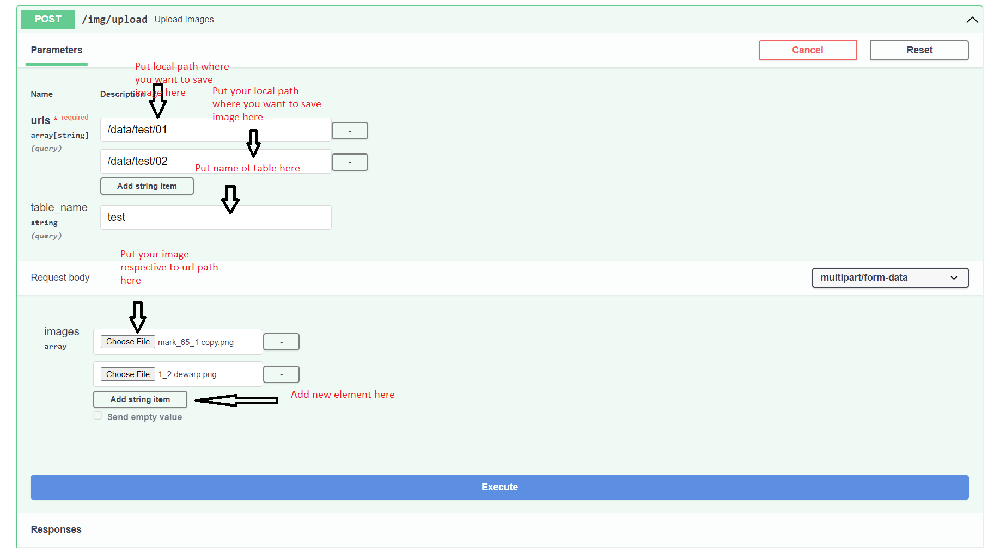

Wait until receive message as below:
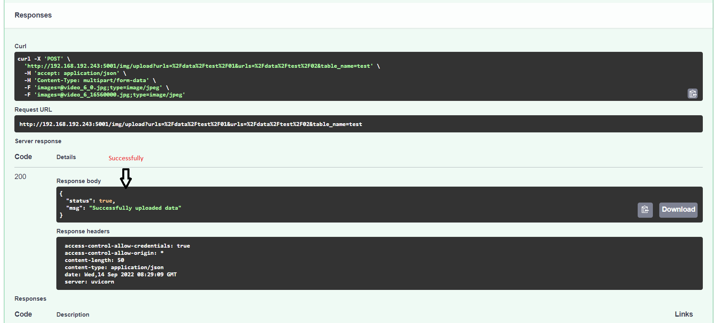

### 4.4 Delete database (OPTIONAL)
- Run this if you want to delete database
Navigate to drop api and work as below:

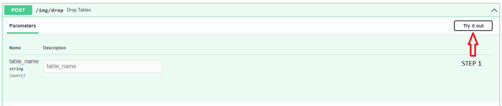

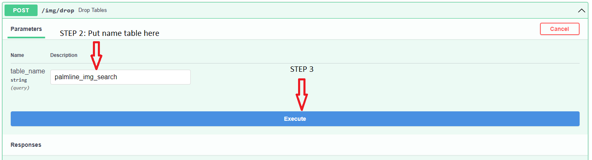

### 4.5 Delete entity (OPTIONAL)
Navigate to drop_entity api and work as below  
table_name: Name of table include the entity   
folder_name: folder's name want to delete

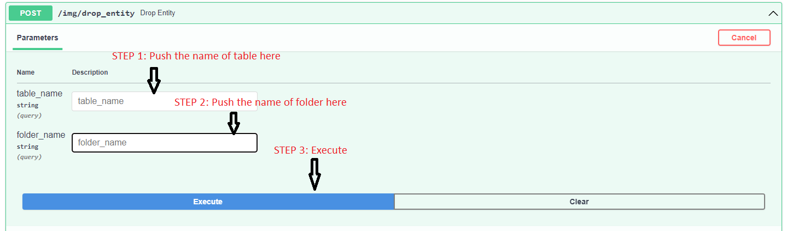

Wait until receive message as below:
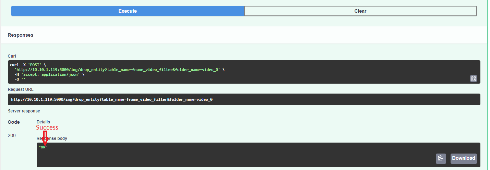

## 4. How to use backup api
Open `127.0.0.1:5002/docs` in your browser to view all the APIs.

- Navigate to backup_data to backup dataset
- Navigate to get_backup_data to get name version data in backup folder
- Navigate to restore_data to restore dataset.
  + name_version: Name of version that you want to backup  